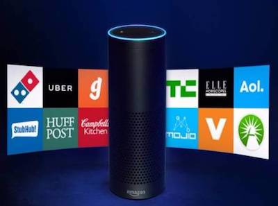

# Alexaビジネスセミナー まとめ
  

## ゲストトークメモ
ゲスト: 横田聡氏(クラスメソッド株式会社)  
テーマ: EchoやAlexaもろもろ

### TL;DR
1. クラウド利用による継続的進化
1. Echoやその他対応機器が豊富
1. Alexa Skill
1. ホームでもビジネスでも利用場面が多様
1. 開発は無料で始められるという手軽さ

### 対応機器
通常のEchoスピーカー以外にもDash Wand、Cloud Camなどいろいろ  
Echo以外にもサードパーティ製機器がある  


### 自社開発
Alexa対応機器の開発が可能  
ラズパイとかでもいける  


### 利用例
`事例1` スタバでの利用  
`事例2` ドミノピザでの利用  
`事例3` Hueでの利用

### マネタイズ
スキルの買い切り、月額課金などで  
Alexaファンドというものも

### 機能面
#### 機能
+ 音声を事前登録し人物を個別に認識
+ プッシュ通知の役割をするボイス通知
+ 会話のテンプレートをあらかじめ登録しておくことで、別パターンの言い回しでもある程度認識することが可能に
+ 単語を登録できる
+ 低~高なコンテキストを想定した開発ができる

```
※コンテキストとは
UXで言う利用文脈のこと
汎用的な定型から固有情報を含む発言まで様々な利用が考えられる
```

#### 履歴とか過去の情報とか、どう扱うか
情報はデータベースに追加して管理

### 利用シーンについて
家庭用だけでなくビジネスにおける利用も視野に  
ビジネスではカレンダーや会議の予約、備品管理、メールのやり取りなど可能

参考: [アマゾン、職場向け「Alexa for Business」発表](https://japan.zdnet.com/article/35111239/)

### Alexaが描く未来
国境をまたぐというよりも世代間のギャップを取り払うことにも繋がり得る(音声利用により)  
音声を用いる業務においては導入・開発利用の価値がある

### 今後期待される機能
+ 複数入力対応
+ 言語翻訳
+ 入力言語を判別する
+ 電話の自動対応
+ 声から性別・年齢・感情を読み取る
+ Alexa側からのアプローチ

### まとめ
国・言語・世代に関係なくAlexaを使えるように  
家庭・オフィス・施設のどこでもAlexaで


## AlexaとEchoの概要

### Echo
プラットフォームはAWS  


### Alexa
クラウドベースの音声サービス

#### 基本的な機能
+ 音声認識
+ 自然言語理解
+ 音声合成
スキルの挙動自体は開発側が担う

#### スキルの種類
+ 標準スキル(Amazonが用意したプリセット)
+ Alexaスキル(サードパーティの開発したもの)

### サードパーティの開発のモチベーション
+ マーケティング目的
+ コンシューマとのタッチポイント
+ スキル向上
+ トレンドに乗っかる
+ etc.  



### 開発のためのツール
+ ASK
+ AVS
+ オンライントレーニング
+ ハンズオントレーニング(無料)

## LTメモ
### エキサイト株式会社
#### さまざまなスキルをリリース
参考: [エキサイト、ヨガや星占いなどAlexa向け音声アプリ54本を提供](https://news.mynavi.jp/article/20171108-a243/)
### ジャパンタクシー
#### 配車サービス利用のためのスキル開発
参考: [日本最大のタクシー配車アプリ「全国タクシー」が「Amazon Alexa」に対応開始](https://japantaxi.co.jp/news/cat-pr/2017/11/08/pr.html)
